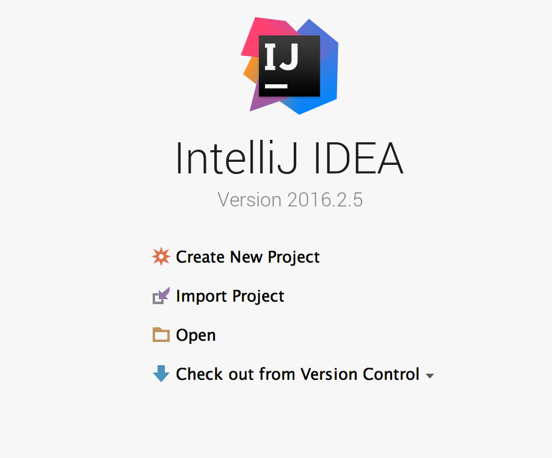
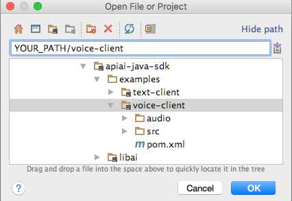
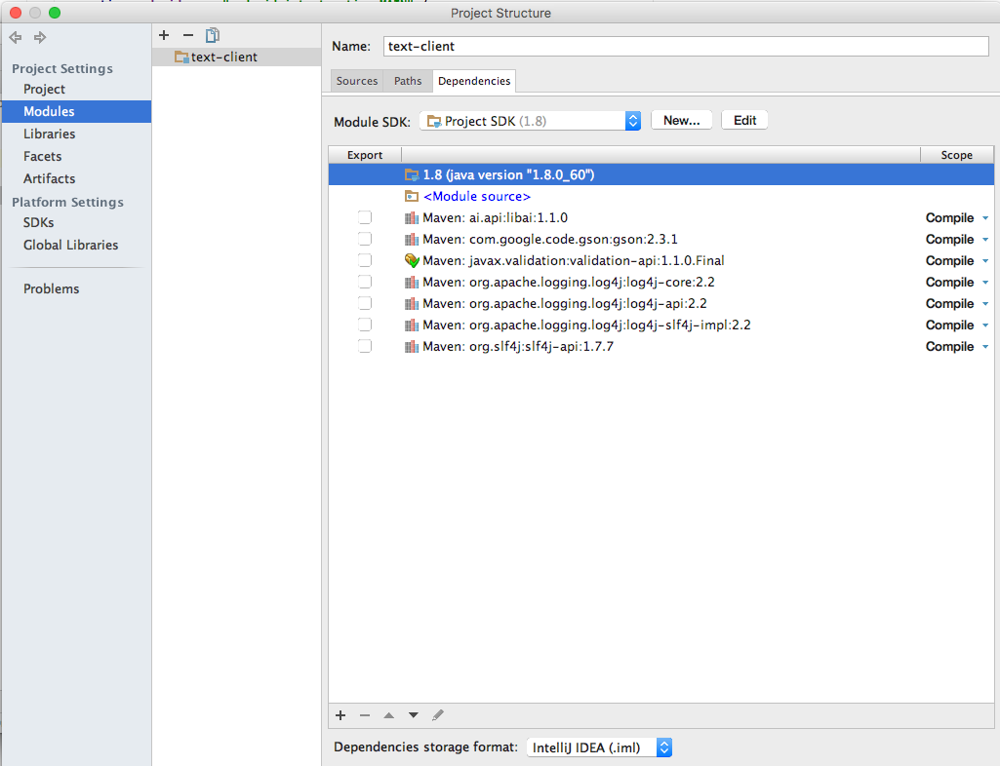

Java SDK for Dialogflow
==================

 

The Dialogflow Java SDK makes it easy to integrate speech recognition with [Dialogflow](http://www.dialogflow.com) natural language processing API on Android devices. Dialogflow allows using voice commands and integration with dialog scenarios defined for a particular agent in Dialogflow.

Authentication is accomplished through setting the client access token when initializing an [AIConfiguration](https://github.com/dialogflow/dialogflow-java-client/blob/master/libai/src/main/java/ai/api/AIConfiguration.java) object. The client access token specifies which agent will be used for natural language processing.

**Note:** The Dialogflow Java SDK only makes query requests, and cannot be used to manage entities and intents. Instead, use the Dialogflow user interface or REST API to  create, retrieve, update, and delete entities and intents.

# Tutorial
This section contains a detailed tutorial on how to work with libai. This tutorial was written for [IntelliJ IDEA](https://developer.android.com/sdk/installing/studio.html).

## Quick Start
1. Create an Dialogflow agent with entities and intents, or use one that you've already created. See the Dialogflow documentation for instructions on how to do this. 
2. Open [IntelliJ IDEA](https://developer.android.com/sdk/installing/studio.html).
3. From the start screen (or **File** menu) , choose **Open...**.  
4. In the Open project dialog, fill **Path** to **dialogflow-java-sdk** directory, then expand examples directory and choose one of the client examples. Then click **Ok**.  
5. Open **Run**, choose **Edit Configuration**. In the Run/Debug Configuration Dialog, fill **program arguments** with your **Client access token**  
6. If there are no errors, you can get the result using **Idea Input/Output** to make text request (**text-client**).

## Work with library source code 
If you want to work with library source code, for some reason, follow these steps:

1. First of all, execute the steps specified in **Quick Start**. Only then go to the next step here.
2.  Open **File**, choose **Project Structure...**, choose **Modules**. Add new module **libai**. After this choose **text-client**(or **voice client**) module. **Remove** Maven: ai.api.libai:1.1.0 and **Add** Module dependency libai. After this click **Apply**.  
3. Try to Run. If there are no errors, you can get the result using **Idea Input/Output** to make text request (**text-client**).

